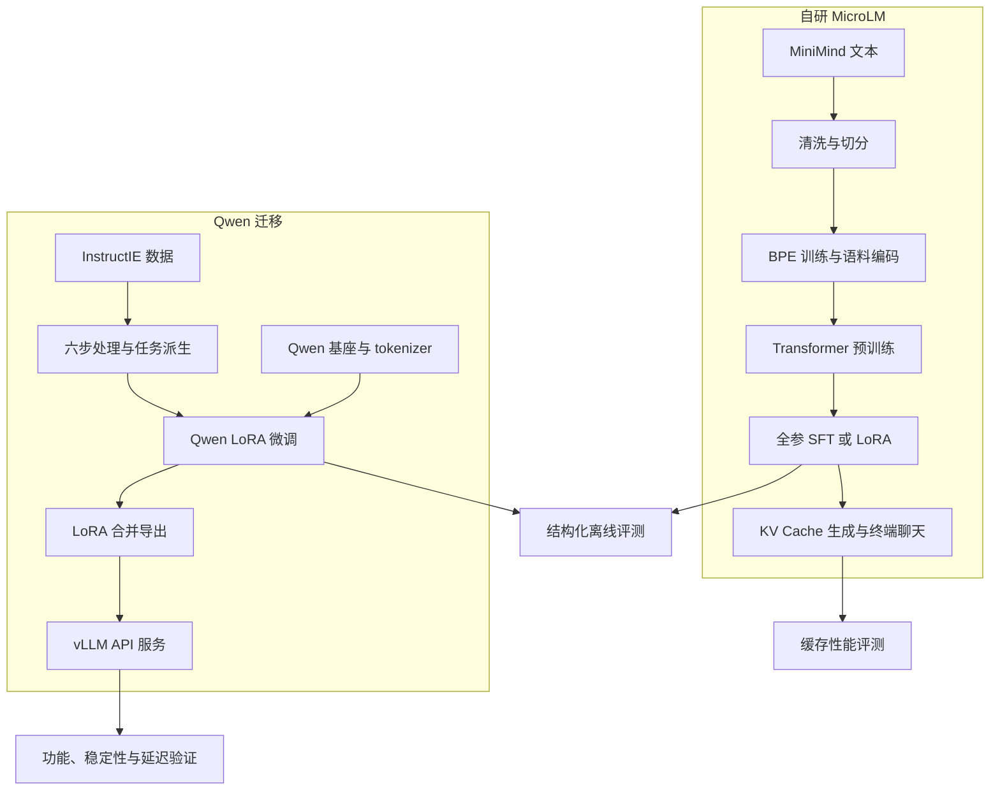

# MicroLM 项目介绍

MicroLM 是一个以理解大语言模型实现原理和完成训练工程实践为目标的 Python 项目。它覆盖语料处理、BPE tokenizer 训练、Transformer 预训练、监督微调（SFT）、低秩适配（LoRA）、带 KV Cache 的文本生成，以及结构化输出评测和模型服务部署。

项目包含两条相互补充的路线：**自研 MicroLM** 用较小模型串起底层实现，**Qwen 迁移路线** 在已有指令模型上完成面向信息抽取的微调与部署。两条路线共享实验方法，但模型权重、tokenizer、数据协议和推理后端各自独立。

本文以仓库中的代码、JSON 配置及已保存评测结果为依据。配置表示计划执行的实验参数，`results/` 表示历史运行记录；文中没有将历史成绩视为当前环境重新运行后的结果。

## 📋 阅读导航

- [项目定位与能力范围](#项目定位)
- [整体架构与目录](#整体架构)
- [自研 MicroLM 技术路线](#自研路线)
- [Qwen 结构化输出路线](#迁移路线)
- [安装与最小验证](#最小验证)
- [训练、推理与部署流程](#运行流程)
- [评测方法与历史结果](#评测结果)
- [当前限制与复现注意事项](#当前限制)
- [代码阅读与扩展方向](#代码阅读)

<a id="项目定位"></a>

## 🎯 项目定位与能力范围

项目适合希望亲手理解语言模型训练过程的学习者，以及需要参考小规模 SFT、LoRA 和结构化评测流程的开发者。其主要价值是让数据、模型、损失函数、训练产物和推理行为之间的关系可以从代码中追踪。

| 维度 | 自研 MicroLM | Qwen 迁移路线 |
| --- | --- | --- |
| 模型起点 | 随机初始化的 Transformer | 本地 Qwen2.5-1.5B-Instruct 基座 |
| 规模 | 正式配置约 31.7M 参数 | 仓库记录约 1.55B 参数 |
| 底层实现 | PyTorch，自定义 Linear、Attention、RMSNorm、SwiGLU 等 | Transformers 加载模型，PEFT 注入 LoRA |
| tokenizer | 自研字节级 BPE | 基座自带 tokenizer 与 chat template |
| 训练数据 | MiniMind 预训练文本与对话数据 | InstructIE 派生的结构化任务数据 |
| 训练方式 | 预训练、全参数 SFT、LoRA SFT | LoRA SFT |
| 推理方式 | 本地生成脚本与终端多轮聊天 | Hugging Face 本地评测、合并权重后 vLLM 服务 |
| 验证重点 | 模块正确性、训练闭环、缓存加速 | JSON 解析、字段约束、格式遵循与服务稳定性 |

现有实现包含从输入数据到部署验证的主要环节。自研小模型仍存在重复、事实错误和指令遵循不足，Qwen 结构化输出也仍有字段缺失和额外字段问题，因此项目更适合作为学习与实验基础。

<a id="整体架构"></a>

## 🏗️ 整体架构与目录



### 目录职责

```text
MicroLM/
├── microlm/
│   ├── model/          # Transformer、LoRA、独立缓存演示
│   ├── tokenizer/      # BPE 训练、编码与解码
│   ├── training/       # 优化器、调度器、损失、数据加载、checkpoint
│   └── inference/      # 推理输入与 prompt 处理
├── scripts/            # 数据、训练、推理、评测和部署入口
├── configs/            # tokenizer、预训练、SFT、Qwen JSON 配置
├── data/               # 已提交的 smoke 数据与数据准备说明
├── eval/               # 固定评测 prompt 集合
├── results/            # 已保存的 JSON / CSV 评测记录
├── tests/              # 六个测试文件
├── Readme/             # 项目全景与核心代码详解
├── docs/               # 项目介绍文档
├── pyproject.toml      # 包信息与依赖声明
└── LICENSE             # MIT 许可证
```

`outputs/`、`reports/` 和完整训练数据目录由运行过程生成或另行准备，当前仓库没有附带正式训练权重。文本生成入口位于 `scripts/generate_text.py`，正式模型的 KV Cache 实现在 `microlm/model/transformer.py`；`microlm/model/kvcache.py` 是独立演示代码。

<a id="自研路线"></a>

## 🧠 自研 MicroLM 技术路线

### 1. 语料清洗与划分

[prepare_pretrain_jsonl.py](../scripts/prepare_pretrain_jsonl.py) 读取逐行 JSON 文本，支持控制字符清理、字符串替换、HTML 清理、空白规范化、长度过滤和精确去重。去重采用 SHA256，训练集与验证集通过 SHA1 哈希确定性划分，输出 `train.txt`、`valid.txt`、`tokenizer_corpus.txt` 与 `metadata.json`。

文档间使用 `<|endoftext|>` 分隔。原始文件版本会影响条数，旧介绍中的“约 141 万条”与 [data/README.md](../data/README.md) 记录的 `pretrain_t2t_mini.jsonl` 1,270,238 条属于不同记录口径；复现实验应以实际下载文件和清洗产出的 metadata 为准。

### 2. 字节级 BPE tokenizer

[bpe.py](../microlm/tokenizer/bpe.py) 从 256 个字节构建基础词表，先做正则预分词，再迭代合并高频相邻字节片段，并保留特殊 token。[tokenizer.py](../microlm/tokenizer/tokenizer.py) 提供编码、解码和迭代式编码能力。

正式配置使用 6,400 词表目标，保存 `vocab.json` 与 `merge.txt`。BPE 训练会读取整个输入文本，正式流程因此先准备较小的 tokenizer 样本，再用训练好的 tokenizer 编码完整语料。词表实际大小还受可合并片段数量影响。

[tokenize_corpus.py](../scripts/tokenize_corpus.py) 将训练、验证文本转为 `.npy` token ID 数组，支持分块读取和批量写出。训练端通过内存映射读取语料，随机抽取定长窗口。

### 3. Transformer 结构

模型主体位于 [transformer.py](../microlm/model/transformer.py)。正式配置来自 [pretrain_full_corpus.json](../configs/pretrain_full_corpus.json)：

| 参数 | 值 | 含义 |
| --- | --- | --- |
| `vocab_size` | 6400 | 模型输入与输出词表大小 |
| `context_length` | 512 | 上下文长度上限 |
| `d_model` | 512 | 隐藏维度 |
| `num_layers` | 8 | Transformer block 数量 |
| `num_heads` | 8 | 多头注意力头数，每头维度 64 |
| `d_ff` | 1344 | 前馈网络中间维度 |
| `rope_theta` | 1000000.0 | RoPE 位置编码参数 |
| `norm_mode` | `pre` | 子层前归一化 |
| `ffn_type` | `swiglu` | 门控前馈网络 |

数据依次经过 token embedding、多层因果自注意力与前馈网络、最终 RMSNorm 和语言模型输出头。注意力只能访问当前位置及之前的 token。输入 embedding 与输出头分别创建，没有绑定为共享权重。

### 4. 预训练与 SFT

预训练使用 next-token prediction：输入窗口为连续 token，目标为向右错开一个位置的序列。训练相关模块包括自定义 AdamW、学习率 warmup 与余弦衰减、交叉熵、梯度裁剪和 checkpoint 保存恢复。

正式预训练配置为 batch size 8、50,000 次迭代、峰值学习率 `2e-4`、warmup 2,000 次、weight decay 0.1，默认设备为 CUDA。这些是配置值，不代表仓库附带了对应训练完成产物。

SFT 数据要求每行包含 `conversations`：

```json
{"conversations": [{"role": "user", "content": "什么是语言模型？"}, {"role": "assistant", "content": "语言模型学习文本中的规律，并预测后续内容。"}]}
```

[sft.py](../microlm/training/sft.py) 统一角色与内容，使用 `<|system|>`、`<|user|>`、`<|assistant|>` 等文本标记渲染对话。标签按 assistant 区间构造，其他位置和 padding 不参与损失。数据集保存行偏移并按需读取样本。

[train_sft.py](../scripts/train_sft.py) 从预训练 checkpoint 初始化，可执行全参微调或 LoRA 微调。全参基线配置为 batch size 2、1,000 步、学习率 `1e-5`，默认关闭 W&B 在线记录。

### 5. LoRA 参数高效微调

[lora.py](../microlm/model/lora.py) 冻结原模型参数，为指定线性层添加低秩矩阵。其计算形式为：

```math
y = Wx + \frac{\alpha}{r}BAx
```

其中 $W$ 是冻结权重，$A$ 和 $B$ 是可训练矩阵，$r$ 是秩，$\alpha$ 控制增量缩放。$B$ 初始为零，因此初始增量为零。实现支持适配器单独保存、加载以及合并和撤销合并。

正式配置在每层 `q_proj`、`k_proj`、`v_proj`、`output_proj` 上使用 `r = 8`、`alpha = 16`。按 8 层、4 个 512 维投影计算，共有 262,144 个 LoRA 参数，约为基础模型规模的 0.83%。适配器不能脱离对应基座和 tokenizer 独立使用。

### 6. 推理与多轮聊天

文本生成包含 prompt 编码、首次完整前向计算（prefill）、逐 token 解码、temperature / top-p 采样、EOS 停止和文本解码。KV Cache 保存各层历史 key/value，使后续解码无需重新计算全部历史 token 的投影。

[chat.py](../scripts/chat.py) 提供终端 REPL，可设置 system prompt、调整采样参数、查看和清空历史、保存会话。支持 `/help`、`/history`、`/clear`、`/save`、`/temp`、`/topp` 和 `/quit`。多轮历史受模型上下文限制，不能据此推断模型支持无限长度记忆。

<a id="迁移路线"></a>

## 🔧 Qwen 结构化输出路线

### 1. 六步数据处理

所有处理阈值与路径集中在 [conf.py](../scripts/conf.py)，原始输入预期位于 `data/instructie/`，文件名为 `train_zh.json`、`valid_zh.json`、`test_zh.json`、`schema_zh.json`。

| 步骤 | 入口 | 作用 |
| --- | --- | --- |
| 1 | [01_normalize.py](../scripts/01_normalize.py) | 统一文本、关系与主题字段 |
| 2 | [02_filter.py](../scripts/02_filter.py) | 硬规则过滤与按主题的 P99 分位数过滤 |
| 3 | [03_quality_tier.py](../scripts/03_quality_tier.py) | 按实体在原文中的匹配等条件划分质量等级 |
| 4 | [04_derive_tasks.py](../scripts/04_derive_tasks.py) | 派生信息抽取、文本转 JSON、格式遵循和 schema 修复任务 |
| 5 | [05_stratified_sample.py](../scripts/05_stratified_sample.py) | 按任务、主题和质量采样 |
| 6 | [06_to_chat_jsonl.py](../scripts/06_to_chat_jsonl.py) | 转写 messages、随机划分内部验证集、输出统计报告 |

当前候选集目标为 30,000 条，内部验证集比例为 5%，在候选数量达到目标时对应 28,500 条训练样本与 1,500 条验证样本。四类任务目标配比依次为 50%、25%、15%、10%。

Qwen 数据使用 `messages` 字段，assistant 的 `content` 为 JSON 字符串。例如：

```json
{"messages": [{"role": "user", "content": "从文本中抽取出生地，以实体为键输出 JSON。文本：张三出生于北京。"}, {"role": "assistant", "content": "{\"张三\": {\"出生地\": \"北京\"}}"}]}
```

该示例仅说明数据结构。实际样本还包含 `id`、`source`、`task_type`、`topic_schema`、`quality_tier` 等元数据，prompt 由任务派生脚本生成。

### 2. Qwen LoRA 训练

[train_qwen_lora.py](../scripts/train_qwen_lora.py) 使用 Transformers 加载本地基座及 tokenizer，使用基座 chat template 构造输入，并通过 PEFT 训练注意力投影上的低秩参数。

| 参数 | 正式配置 |
| --- | --- |
| 基座目录 | `./Qwen2.5-1.5B-Instruct` |
| LoRA 目标 | `q_proj`、`k_proj`、`v_proj`、`o_proj` |
| 秩 / alpha / dropout | 8 / 16 / 0.05 |
| 学习率 / weight decay | `2e-5` / 0.01 |
| batch size / 梯度累积 | 4 / 4，单进程有效 batch size 为 16 |
| 最大训练步数 | 2000 次优化器更新 |
| 最大序列长度 | 512 |
| warmup | 100 步，之后保持恒定学习率 |
| 验证 / 保存间隔 | 100 / 500 步 |
| 默认设备与精度配置 | CUDA，`fp16: true` |

训练生成 `adaptor_final/`、按最低验证损失保存的 `best_adaptor/` 和 `train_log.jsonl`。最终步适配器与最佳验证损失适配器是不同选择，离线评测与部署时应显式记录所用版本。

### 3. 导出与服务化

[export_final_model.py](../scripts/export_final_model.py) 加载基座和适配器，通过 `merge_and_unload()` 合并权重，保存模型、tokenizer 与 `export_metadata.json`。默认合并 `adaptor_final`，输出 `outputs/qwen_lora_merged_final/`。

[serve_vllm.sh](../scripts/serve_vllm.sh) 加载合并目录，启动兼容 OpenAI 接口形式的 API。项目还提供功能 smoke、结构化稳定性和本地吞吐延迟测试脚本，形成训练产物到服务验证的闭环。

<a id="最小验证"></a>

## 🚀 安装与最小验证

### 环境与依赖

仓库声明 Python 3.11 及以上，核心依赖包括 PyTorch、NumPy、regex、einops 和 W&B；具体内容见 [pyproject.toml](../pyproject.toml)。以下命令均在仓库根目录执行：

```bash
pip install -e ".[dev]"
python -m pytest tests/
python scripts/train_pretrain.py --config configs/pretrain_smoke.json
```

预训练 smoke 使用已提交的 `data/smoke/train_ids.npy` 和 `valid_ids.npy`，在 CPU 上运行 20 次迭代，模型为 2 层、隐藏维度 128、上下文 64、词表大小 512。预期产物包括 `outputs/pretrain_smoke/ckpt_final.pt` 与模型配置。

若需验证 tokenizer 的独立小流程，可运行：

```bash
python scripts/train_tokenizer.py --config configs/tokenizer_smoke.json
python scripts/tokenize_corpus.py --config configs/tokenize_smoke.json
```

这组 tokenizer 配置的词表目标是 320，编码结果写入 `outputs/tokenized_smoke/`；默认预训练 smoke 仍读取仓库自带的 `data/smoke/` 数组，不会自动切换到新编码结果。

Qwen 路线可安装 `pip install -e ".[all]"`，部署另需 `pip install vllm`。完整训练默认使用 CUDA；仓库未锁定精确依赖版本，也没有提供可保证适用于所有设备的显存下限。本文未重新验证具体版本组合或部署平台兼容性。

<a id="运行流程"></a>

## 🛠️ 训练、推理与部署流程

### 1. 自研正式训练

先按 [根 README](../README.md) 和 [数据说明](../data/README.md) 准备 MiniMind 原始文件。预训练入口预期为 `data/pretrain_t2t_mini.jsonl`，SFT 入口预期为 `data/minimind_sft/gongjy/minimind_dataset/sft_t2t_mini.jsonl`。

```bash
python scripts/prepare_pretrain_jsonl.py \
  --input-path data/pretrain_t2t_mini.jsonl \
  --output-dir data/pretrain_clean \
  --document-separator "<|endoftext|>" \
  --replace-literal '<|im_end|>=\n' \
  --replace-literal '<|im_start|>=\n' \
  --replace-literal '<think>=\n' \
  --replace-literal '</think>=\n' \
  --clean-html
```

接着从 `tokenizer_corpus.txt` 准备 `tokenizer_sample.txt`。下面按完整行选取最多 50,000 行作为示例；这不是历史实验字节采样方案的精确复刻，样本大小会影响 BPE 结果与训练耗时。

```bash
head -n 50000 data/pretrain_clean/tokenizer_corpus.txt > data/pretrain_clean/tokenizer_sample.txt
python scripts/train_tokenizer.py --config configs/tokenizer_full_clean.json
python scripts/tokenize_corpus.py --config configs/tokenize_full_corpus.json
python scripts/train_pretrain.py --config configs/pretrain_full_corpus.json
python scripts/train_sft.py --config configs/sft_baseline.json
```

全参 SFT 前应先将独立验证集路径填入配置。需要执行 LoRA 分支时，检查下一节说明的 EOS 差异，并将 tokenizer、SFT 与推理配置统一后运行：

```bash
python scripts/train_sft.py --config configs/sft_lora.json
```

### 2. 自研模型交互

完成上述全参 SFT 后，可使用对应的配置、词表和 checkpoint 启动聊天：

```bash
python scripts/chat.py \
  --checkpoint-path outputs/sft_baseline/ckpt_final.pt \
  --config-path configs/sft_baseline.json \
  --vocab-path outputs/tokenizer_full_clean/vocab.json \
  --merges-path outputs/tokenizer_full_clean/merge.txt \
  --eos-token '<|endoftext|>' \
  --max-new-tokens 128
```

`--device` 默认自动选择。加载 LoRA 时还需正确匹配基础权重与 `--lora-path`，不能将已经合并的权重当作原始基座再次叠加同一适配器。

### 3. Qwen 数据处理与训练

先准备前述四个 InstructIE 文件以及完整的 `Qwen2.5-1.5B-Instruct/` 本地模型目录，再依次运行：

```bash
python scripts/01_normalize.py
python scripts/02_filter.py
python scripts/03_quality_tier.py
python scripts/04_derive_tasks.py
python scripts/05_stratified_sample.py
python scripts/06_to_chat_jsonl.py
python scripts/train_qwen_lora.py --config configs/qwen_lora_structured_smoke.json
python scripts/train_qwen_lora.py --config configs/qwen_lora_structured.json
```

Qwen smoke 为 50 步，仍依赖真实基座与 `data/sft_candidate/`，并默认使用 CUDA。它验证训练链路可运行，不能替代正式效果评估。

### 4. 离线评测与部署验证

下面显式使用最终步适配器评测，与随后的默认导出选择保持一致。`--skip-microlm` 允许只验证 Qwen 路线；已有自研产物时可以去掉该选项进行四模型比较。

```bash
python scripts/run_instructie_eval.py \
  --skip-microlm \
  --qwen-adaptor-path outputs/qwen_lora/adaptor_final \
  --out-dir results/instructie_eval_local
python scripts/export_final_model.py --adaptor adaptor_final
bash scripts/serve_vllm.sh --host=127.0.0.1 --port=8000
```

服务在前台运行。在另一个终端执行：

```bash
python scripts/smoke_vllm.py --structured
python scripts/check_structured_stability.py --rounds 2
python scripts/bench_vllm_local.py --quick --streaming
```

Shell 启动脚本接受 `--port=8000` 这样的等号形式参数。服务默认地址为 `http://localhost:8000/v1`；改变端口后，应同步设置验证脚本的 `--base-url`。

### 5. 产物对应关系

| 阶段 | 默认关键产物 | 后续用途 |
| --- | --- | --- |
| BPE 训练 | `outputs/tokenizer_full_clean/vocab.json`、`merge.txt` | 语料编码、SFT 与推理 |
| 语料编码 | `data/pretrain_clean/tokenized_full/*_ids.npy` | 自研预训练 |
| 预训练 | `outputs/pretrain_full_corpus/ckpt_final.pt`、`model_config.json` | SFT 初始化、文本生成 |
| 全参 SFT | `outputs/sft_baseline/ckpt_final.pt`、`train_log.jsonl` | 自研对话与对比评测 |
| 自研 LoRA | `outputs/sft_lora/ckpt_final.pt`、`lora_adaptor.pt` | LoRA 加载及对比实验 |
| 结构化数据处理 | `data/sft_candidate/`、`reports/` | Qwen 训练及数据检查 |
| Qwen LoRA | `outputs/qwen_lora/adaptor_final/`、`best_adaptor/` | 评测、合并导出 |
| 合并导出 | `outputs/qwen_lora_merged_final/` | vLLM 服务加载 |
| 评测 | `results/` 下的 JSON、CSV | 结果追踪与实验比较 |

<a id="评测结果"></a>

## 📊 评测方法与历史结果

### 1. 正确性与通用生成检查

`tests/` 包含六个文件，覆盖模型算子与形状、tokenizer 往返与迭代编码、优化器与学习率调度、checkpoint 恢复、SFT 标签掩码、推理 prompt 处理和 LoRA 行为。它们验证局部实现，不直接衡量语言能力。

[eval/](../eval/) 提供通用与结构化 prompt 集合，[run_eval_prompts.py](../scripts/run_eval_prompts.py) 用于通用生成检查。保存的 [LoRA 与全参生成样本](../results/lora_vs_full_sft/eval_results.json) 可用于观察重复、跑题与指令遵循差异，不应直接当作标准化能力榜单。

### 2. KV Cache 性能

[历史 benchmark](../results/kvcache_benchmark.json) 记录 CPU、float32、上下文 512 的测试，prompt 长度为 16 / 32 / 64 / 128 / 256，生成长度为 32 / 64 / 128 / 256，每组预热一次、测量三次。

20 组结果的加速比平均约 3.86 倍，最高 9.08 倍。最高值对应 prompt 256、生成 256，记录耗时从 24.8299 秒降至 2.7335 秒。该结果说明缓存可以减少历史计算，不能推广为任意硬件与长度下的固定加速比。

### 3. 结构化离线评测

[run_instructie_eval.py](../scripts/run_instructie_eval.py) 的指标包括 JSON 可解析率、缺字段比例、额外字段比例、严格 schema 通过率和别名归一化后的严格通过率。代码中的 `hallucination_rate` 指“出现额外字段的样本比例”，不是通用事实幻觉率。

[已保存排行榜](../results/instructie_eval/summary/leaderboard.json) 在 40 条 prompt 上记录如下：

| 模型 | JSON 可解析 | Strict | Alias-Strict | 缺字段 | 额外字段 |
| --- | --- | --- | --- | --- | --- |
| MicroLM SFT | 0% | 0% | 0% | 100% | 0% |
| MicroLM LoRA | 0% | 0% | 0% | 100% | 0% |
| Qwen Base | 100% | 10.0% | 7.5% | 82.5% | 65.0% |
| Qwen LoRA | 97.5% | 7.5% | 15.0% | 80.0% | 67.5% |

Qwen LoRA 的 Alias-Strict 从 3/40 提升到 6/40，但原始 Strict 和 JSON 可解析率略降，额外字段比例略升。排行榜按原始 Strict 排序，因此 Qwen Base 排名更高。Alias-Strict 是另一套字段处理口径，不能假设一定高于原始 Strict。

[结构质量补充结果](../results/instructie_eval/summary/structural_quality.json) 显示，Qwen LoRA 的实体键结构比例从 57.5% 提升至 95.0%，中文字段比例从 55.0% 提升至 92.5%，平均字段重合度从 0.1697 提升至 0.49。这支持“微调改善了部分目标结构行为”，但不支持“所有能力全面提升”。

自研模型的额外字段比例为零同时伴随零解析率，不能解释为输出可靠。40 条 prompt 的结果也不足以替代大规模独立测试或关系抽取准确率、召回率、F1 评估。

### 4. 服务验证

[vLLM 历史记录](../results/vllm_benchmark/) 包含 smoke、稳定性与性能测试：

- smoke 记录为 5/5 通过。
- 普通生成和 `response_format=json_object` 两轮稳定性测试各有 40 条，JSON 可解析率均为 100%，但两轮 Strict 与 Alias-Strict 均为 0%。
- 单并发性能摘要中的平均生成速度约为 29.4～32.19 token/s，取决于输入与输出长度。

因此，服务能够响应并输出合法 JSON，不等于字段或抽取内容正确。离线评测与服务评测的适配器、prompt、采样和后处理条件也必须一致，才能进行严格比较。

<a id="当前限制"></a>

## 🧭 当前限制与复现注意事项

| 事项 | 当前情况与影响 |
| --- | --- |
| 数据与权重依赖 | 新 clone 包含 smoke 数据和历史结果，正式数据、tokenizer 与模型权重需自行生成或准备 |
| 自研验证集 | `sft_baseline.json`、`sft_lora.json` 的 train / valid 指向同一文件；默认验证损失不能作为独立泛化指标 |
| SFT smoke 依赖 | `sft_smoke.json` 使用正式 6400 词表及正式预训练 checkpoint，不能直接接在 512 词表的 pretrain smoke 后运行 |
| EOS 一致性 | 正式 tokenizer 与全参 SFT 使用 `<|endoftext|>`，现有 LoRA 配置和 chat 默认值使用 `</s>`；新增 token 可能改变词表尺寸，需核对训练、模型配置和加载逻辑 |
| Qwen 内部切分 | 最终脚本先派生样本再随机切分，同一原始文本的不同派生任务可能跨 train / valid；更严格的实验应按原始样本分组切分 |
| JSON 数据校验 | 第六步对不合法 assistant JSON 仅打印警告，未强制中断或剔除，历史“100% 合法”不构成后续运行保证 |
| 数据报告口径 | 第六步报告中部分上游样本数量为硬编码历史值；更换数据或阈值后应核对各步实际统计 |
| 配置文档时效 | `configs/README.md` 仍称配置尚未接入训练；当前训练入口已经支持 `--config`，以脚本为准 |
| 适配器版本 | 离线评测默认 `best_adaptor`，导出默认 `adaptor_final`；比较实验时显式统一 |
| 缓存与上下文 | 自研缓存生成限制输入与生成总长不超过上下文；当前 block 实现不支持 post-norm 配合 KV Cache 的路径 |
| 日志与复现 | 部分配置开启 W&B online；按运行需求检查 logging，并记录依赖版本、随机种子、数据版本和模型来源 |

这些限制不会否定项目的训练工程价值，但会影响对实验结论的解释。尤其应将“训练代码可以运行”“loss 下降”“输出 JSON 合法”“任务内容正确”分别验证。

<a id="代码阅读"></a>

## 📚 代码阅读与扩展方向

### 建议阅读顺序

1. 从 [transformer.py](../microlm/model/transformer.py) 理解张量形状、归一化、位置编码与因果注意力。
2. 阅读 [tokenizer/](../microlm/tokenizer/) 和 [training/](../microlm/training/)，理解文本如何转为训练目标。
3. 阅读 [train_pretrain.py](../scripts/train_pretrain.py)、[train_sft.py](../scripts/train_sft.py) 与 [lora.py](../microlm/model/lora.py)，串起预训练与微调。
4. 阅读 [generate_text.py](../scripts/generate_text.py)、[chat.py](../scripts/chat.py) 与 [benchmark_kvcache.py](../scripts/benchmark_kvcache.py)，观察推理协议和缓存成本。
5. 阅读六步数据处理、[train_qwen_lora.py](../scripts/train_qwen_lora.py) 和 [run_instructie_eval.py](../scripts/run_instructie_eval.py)，理解迁移实验如何连接数据与指标。
6. 最后阅读导出、服务启动及验证脚本，追踪部署模型与离线实验是否一致。

### 可继续推进的方向

优先完善独立数据划分、EOS 与词表一致性、适配器版本追踪和自动数据校验，再扩大结构化测试集并加入内容级抽取指标。在此基础上，可继续研究训练效率、缓存内存管理及更长上下文实验；这些属于后续方向，当前仓库没有提供完整实现保证。

详细设计与历史复盘可参阅 [项目全景图](../Readme/项目全景图/) 和 [核心代码解析](../Readme/核心代码解析/)。项目代码采用 [MIT License](../LICENSE)；外部数据和基座模型的使用条件应分别核对其来源说明。
